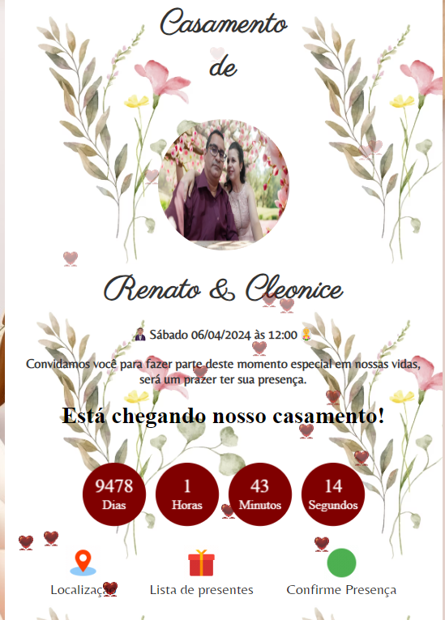

# Convite casamento com interações

<h1> Projeto desenvolvido em HTML | CSS | JAVASCRIPT </h1>

<a href='https://convite-casamento-nine.vercel.app/' target="_blank" >&#11177; <button>Confira o projeto clicando aqui</button> &#11176;</a><br> 



## Funcionalidades

- Fornece informações atualizadas sobre a localização da festa, lista de presentes e lista de presentes.
- Exibe informações detalhadas sobre o casamento como data e hora e um contador regressivo em JS.

## Tecnologias

Este projeto foi construído com as seguintes tecnologias:

- [HTML](https://developer.mozilla.org/pt-BR/docs/Learn/Getting_started_with_the_web/HTML_basics)
- [CSS](https://www.w3schools.com/css/default.asp)
- [JavaScript](https://developer.mozilla.org/en-US/docs/Web/javascript)

## Como Usar

Clone o projeto

```bash
  git clone https://github.com/joserenatofelix/Convite-Casamento

```

Abra o arquivo index.html em seu navegador.


